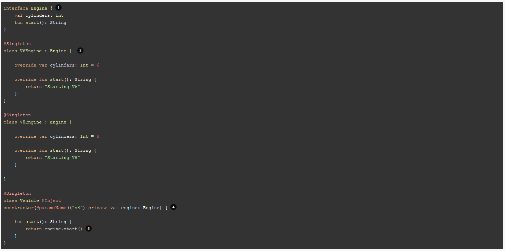

<h1>Micronaut</h1>

<h2>Introdução</h2>

<p>Micronaut é um framwework baseada na JVM que é focado para a criação de microserviços. Seu lançamento se deu em outubro de 2018.</p>

<p>Entre seus diferencial dos outros concorrentes estão:
<ul>
<li><a href="http://blog.gabrielamorim.com/java-reflection-um-exemplo-pratico/">Refletions</a>;</li>
<li> <a href="https://en.wikipedia.org/wiki/Memory_footprint">Memory footprint</a> - quantidade de memória que um programa usa para a sua execução;</li>
<li><a href="https://refactoring.guru/pt-br/design-patterns/proxy/java/example">Proxies</a>;</li>
<li>Geração de bycode em tempo de execução</li>
<li>Fácilidade com testes unitários.</li>
</ul>
</p>

<p>Documentaçao oficial do <a href="https://docs.micronaut.io/latest/guide/">Micronaut</a></p>

<h2>Inversão de controle</h2>

<p>No micronaut a implementação de injeção de dependência é feita no tempo de compilação</p>

<h2>Bean</h2>
<p>Um Bean é um objeto que possui seu ciclo de vida controlado pelo Containet IOC. Isso inclui criação, execução e destruição.</p>

<h2>Qualificador de Bean</h2>


<p>*Usando @param:Named("v8") para difinir qual bean deseja ser utilizado.</p>

<p>Micronaut is capable of injecting V8Engine in the previous example, because:
@Named qualifier value (v8) + type being injected simple name (Engine) == (case insensitive) == The simple name of a bean of type Engine (V8Engine)
</p>
 

<h2>Scopes</h2>


 <h2>Fábrica de Beans</h2>

 <p>Disponibilizar como um bean uma classe que não faz parte de sua base de código, como aquelas fornecidas por bibliotecas de terceiros. Neste caso, você não pode anotar a classe já compilada. Em vez disso, você deve implementar a @Factory</p>

 

 <h2>Beans Condicionais</h2>

<p>É possível definir quando um bean será carregado ou não através da anotação @Requires. No exemplo abaixo, um bean só será carregado se  tiver a property chamada foo (pode ser definida em um arquivo do tipo .properties)</p>


<p>É possível também definir mais de um requisito, a saber:</p>


<p>Parâmetros de condição para o @Requires:</p>
 

 <h2>Bean Introspection</h2>

 <p>A BeanIntrospection permite que um bean seja instanciado e possa ler/ escrever propriedades sem fazer uso de reflection. Uma situação de uso é quando precisamos utilizar anotações como @NotNull e assim validar informações. Para tal é preciso anotar a classe com @Introspected.</p>

 

<p>Necessário ter a dependência inject-java para utiliza-la</p>
<p>Exemplo de declaração no gradle: <br> implementation("io.micronaut:micronaut-inject-java:2.3.4")</p>

<h2>Bean Validation</h2>

<p>Micronaut possui suporte para anotações do tipo javax.validation. É necessário implementar a seguinte dependência ao seu projeto:</p>


<p>Comentar depois...</p>

<h2>Application Configuration</h2>

<p>Assim como outros frameworks aka Spring Boot e Grails, o Micronaut permite utilizar arquivos de configurações em vários formatos, como: application.yml, application.properties, application.json or application.groovy , além de varíaveis de ambiente.</p>

<h2>Configuration Injection</h2>
<p>Para utilizar um valor definido nos arquivo de configuração, podemos utilizar a anotação @Value.</p>


<p>Existe outra alternativa, que é utilizar a anotação @Property, que permite obter a chave e o seu respectivo valor:</p>


<p>Recuperando chave/valor de arquivos de configuração</p>


<h2>Manipulação de cache</h2>

<p>

The following cache annotations are supported:

    @Cacheable - Indicates a method is cacheable in the specified cache

    @CachePut - Indicates that the return value of a method invocation should be cached. Unlike @Cacheable the original operation is never skipped.

    @CacheInvalidate - Indicates the invocation of a method should cause the invalidation of one or more caches.

Using one of these annotations activates the CacheInterceptor, which in the case of @Cacheable caches the return value of the method.

The emitted result is cached if the method return type is a non-blocking type (either CompletableFuture or an instance of Publisher) .

In addition, if the underlying Cache implementation supports non-blocking cache operations, cache values are read without blocking, resulting in non-blocking cache operations.
</p>

<h2>Gerenciador de tarefas</h2>
<p>É possível configurar o tempo em que um método é executado. Para isso usamos a anotação @Scheduled.</p>


<p>A tarefa acima é executada a cada cinco minutos</p>

<h2>HTTP Server</h2>

<p>Dependência: implementation("io.micronaut:micronaut-http-server")</p>

<p>Binding Annotations</p>


<p>Url Matching</p>


<p>HttpRequest e HttpResponse</p>

<p>Para se ter uma melhor controlle sobre as requisições o Micronaut possui uma serie de interfaces:</p>


<p>Por default o controller do Micronaut produz/consume application/json. Entretanto é possível configurar o tipo de mídia (Content-Type) produzido/consumido:</p>


<p>Alterando o tipo Content-Type produzido</p>


<p>Alterando o tipo Content-Type consumido</p>

<h2>Processamento de Solicitação Http Reativa</h2>

<p> O Micronaut é construido no Netty, que é projetado em torno de um modelo de loop de evento e E / S sem bloqueio. Então em situações onde é necessário realizar operações como acessar sistemas de arquivos, banco de dados, rede, servidores, entre outros é recomendado separar essas tarefas para um pool de threads separados para não bloquear o loop de eventos.</p>

<p>É possível configurar um pool de teste da seguinte forma:</p>


<p>E a maneira mais simples de utilizar é usando a anotação @ExecuteOn</p>


<p>Jackson Configuration</p>


<p>Features</p>


<h2>Tratamento de erros</h2>

<p>Para realizar o tratamento de erros, o micronaut oferece algumas alternativas:</p>
<p>Com a anotação @Error é possível capturar o erro em um método e tratá-lo. Esses métodos devem estar definos em classes anotadas com @Controller e podem tratar erros locais ou globais (erros locais sempre são buscados em primeiro)</p>

<p>Tratamento de erros locais:</p>

<p>No exemplo acima o método está capturando e tratando a exceção JsonParseException</p>

<p>Tratamento de erros globais:</p>


<p>ExceptionHandler:</p>
<p>Como altenativa a opção apresentada acima, podemos criar um ExceptionHandler que irá capturar as exceções a serem tratadas durante uma requisição HTTP request.</p>

<p>Então, imagine que o seu e-commerce lança uma exceção para indicar que determinado livro está fora de estoque</p>


<p>Lançando a exceção no controller:</p>


<p>Caso não seja tratada, irá retornar 500 (Internal Server Error). Para que seja retornado 400 (Bad Request), criamos um ExceptionHandler:</p>


<p>Ver sobre Session...</p>

<h2>HTTP Client</h2>

<p>Com o micronaut também é possível realizar requisições para outros endpoints. Para tal inicialmente sua aplicação deve conter a seguinte dependência:</p>

<p>Dependência: implementation("io.micronaut:micronaut-http-client")</p>

<p>Umas das formas é utilizando a anotação @Client em uma interface ou uma classe abstrata e o método que possui os parâmetros necessários para realizar a requisição (entrada e saída)</p>


<p>Se uma Http Response é retornada com código igual ou maior que 400, uma  HttpClientResponseException é lançada. Esta possui a resposta original.</p>

<p>Client Fallbacks</p>

<p>Em se tratando se sistemas distribuidos, falhas acontecem. É possível definir uma implementação de fallback se todas as outras alterativas de conexão foram falhas.</p>


<h2>Configurações distribuidas</h2>

<p>Assim como em outros frameworks, é possível externalizar as configurações da sua aplicação. Isso é feito pois além de permitir a reutilização para outras aplicações, facilita na hora de alterar as configurações (já que haveria necessidade de apenas alterar um ponto central).</p>

<p>HashiCorp Consul Support</p>

<p>Consul é um dos mais populares serviços de configuração distribuída desenvolvido pela HashiCorp</p>

<p>Uma maneira fácil de utiliza-lo é através do docker:</p>

```
docker run -p 8500:8500 consul
```

<p>Para habilitar a configuração distribuída, crie uma arquivo em src/main/resources/ chamado bootstrap.yml (em ordem de precedência, o arquivo escrito com bootstrap é verificado antes do application. É comunmente utilizado para adicionar configurações que serão buscadas de fontes externas, como o consul).</p>


<p>E para que o micronaut consiga ser descoberto pelo consul, adicione a seguinte dependência:</p>

```
implementation("io.micronaut:micronaut-discovery-client")
```


<p>As configurações poderão ser armazenadas por padrão na pasta /config do Consul, e apartir dela o Micronaut irá procurar os valores nos diretórios em ordem de precedência</p>

```
Você pode mudar o diretório a ser buscado com a configuração: consul.client.config.path
```


<p>O valor de APPLICATION_NAME é o que você configurou em micronaut.application.name no bootstrap.yml.</p>

<p>No consul, diversos formatos de arquivos são suportados (ver em <a href="https://docs.micronaut.io/latest/api/io/micronaut/discovery/config/ConfigDiscoveryConfiguration.Format.html">ConfigDiscoveryConfiguration.Format</a>) e para definir esse formato é preciso utilizar a configuração abaixo:</p>


<p>Para saber mais veja em: <a href="https://micronaut-projects.github.io/micronaut-discovery-client/latest/guide/index.html#serviceDiscoveryConsul">Consul Support</a></p>
